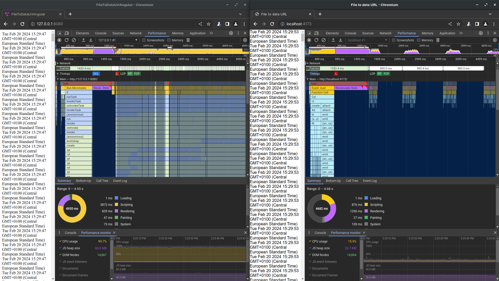

# May I humbly submit you my front-end framework ?

Hi everyone, I'll present you what I consider my best personal achievement so far: [a framework purely based on Reactive Programming](https://dom.lirx.org/docs/documentation/getting-started/introduction/)
(ak: Observables and Signals) to create great web applications.

I did it because I was seeing the advantages and limits in React, Angular, and Svelte.

So I wanted to create something taking the best of all: a performant framework, built with optimizations in mind, constrained component structure,
and based on [reactive programing](https://en.wikipedia.org/wiki/Reactive_programming).

Maybe it's a genius idea, maybe it's not, but in any case, if it may inspire people, I'll be happy with that.

## Introduction: what we really want ?

First let's define what makes a great framework, and what we want as developers and companies.

### Developers wants reactivity

In front-end, our interfaces **react** to changes: an event appends (like a click, a promise resoling, a websocket packet, a timer, etc...),
and we have to update our interface (meaning update the DOM) reflecting the new data.
So everything in front-end is fundamentally reactive.

If we compare some frameworks:

Angular inclues `rxjs` but was not built with reactivity in mind.
However, we may see a clear requirement from the developers: it has an `async` pipe, recently `signal` were introduced, and `Stores` are common.
Sadly, the framework itself is not optimized at all for reactivity. It was not built for it, and checking the source code highlight these limitations.

React has `useState` and `useEffect` (with others) which are essentially *reactive* variables and context.
Now, we may consider it as a *reactive framework*, however it was not initially though for it, and we must use tricks like memoization using `useCallback` or `React.memo` for example.

Finally, Svelte is natively based on reactivity, which provides excellent performances.

### Developers wants well-structured projects

One of the best argument in favor of Angular is how it enforces a specific structure for the projects.
When dealing with very large applications, it becomes very important to have a structured architecture having well organized files, directories and components.
Something that the recommandations, best practices and `cli` offers: an opinionated way to structure the apps, that works very well.

This is in my opinion where React and Svelte struggle: they don't offer an `unique` way of structuring the projects nor coding the components.

It's up to us to:

- create our own structure. 
- split, the css, html and js. 
- select what kind of css-or-js we want.
- choose the front-end tooling we want (nextjs, gatsby, etc...).

This flexibility is fantastic for small projects, but becomes a nightmare in very large applications:
for X developers, it results in X ways of coding the components, X ways to organize them, X different ways to import css, etc.
Something that becomes quickly impractical, and very hard to maintain. If you're working in big tech companies, you know the struggle.

With big projects, we'll need to have very strict guidelines and documentation to organize projects, or it will become cumbersome and a horror to works on.

### Companies wants stability

A company frequently works with code that will probably last forever.
We all have an example of a legacy code that nobody want to touch but is critical for the business (ex: a login page), or very large projects that are build in years.
So having something that can resist time is important. This means: no-breaking changes, evolution that keeps retro-compatibility and avoid changing everything in the framework.

This is something that is hard to stick to over time: new ideas often tend to radically change how we use a framework.

React changed to *hooks*: it was a revolution, but the "old way" kept working which is great for long term projects.
Angular reworked entirely its engine, and it was mostly transparent for the developers. In my opinion, this is currently the most stable of all the frameworks,
making it a very good choice for large companies.

So stability is a critical point for any giant business.

> Sadly, this is something I cannot provide yet, but somewhere in the future, with a bigger community, why not ?

## Presentation of my framework

I've named my framework `LiRX` which is an abbreviation for `Light Reactive X`.
It is build on the following premises, based on the based on the previous observations:

- **reactivity as first-class citizen**: the components are compiled to pure javascript to increase drastically the performances, and the DOM is rendered from Observable changes 
with very fined grained and optimized pipelines. Only what changes is rendered and the minimal javascript execution is done each time.
- the framework follows an **MVC structure**: each component has an `.html`, `.scss` and `.ts` file.
Separating these concerns is very important in large applications, in order to keep a coherent structure.
- **performance** always in mind: everything is optimized in such a way that any change in the application triggers the minimal javascript execution time and path as possible.
Moreover, it was build to use the full potential of minifiers (efficient tree-shaking, unroll when possible, pre-compile if possible).

It comes in different modules:

- [@lirx/core](https://core.lirx.org/): this is the library used to build Observables, Signals, and pipe them.
- [@lirx/dom](https://dom.lirx.org/): this is the library used to **build web applications** using Observables.

More packages are available like a [router](https://github.com/lirx-js/router) and [material components](https://github.com/lirx-js/dom-material), but are not complete now.
It will be for another tutorial in the future.

### Reactive programming

First, for people not familiar with Reactive Programming, I'll resume quickly:

> Reactive Programming is about data streams and dynamic values (values changing over time).

Reactive Programming frameworks (like `@lirx/core` or `RxJS`) gives you tools to create such streams or dynamic values (ak: Observables/Signals), and combine them in complex pipelines.
As opposed to imperative programming, values keep track of their changes, and automatically update any dependent.

Here's a quick example:

```ts
const b = signal(1);
const c = signal(2);
const a = computed(() => a() + b());
b.set(10);
console.log(a()); // 12
```

If any of `b` or `c` change, then `a` will change too.

What's great is that you can listen to these changes:

```ts
effect(() => {
  console.log(a());
});
// asuming `b = 1` and `c = 2`, then `3` is displayed
b.set(10); // by setting `b = 10`, `a` is updated, and `12` is displayed
```

Thus, me may build a framework around such a concept, and only update the absolutely necessary DOM nodes when a change occurs in the app.
All of this without the necessity to run a differ algorithm or generating a new Virtual DOM.


### @lirx/dom

Alright, to keep everything as short as possible (not an easy task for a framework),
I'll give you a sneak peek and partial examples demonstrating the potential of [@lirx/dom](https://dom.lirx.org/docs/documentation/getting-started/introduction/).

The framework is based around [components](https://dom.lirx.org/docs/documentation/component/component/): a component is an `HTMLElement` with its own template (html), style (css or scss), and javascript (actually typescript).
When repeating (creating many components), they'll form a complete application.
They are like the bricks forming a house.

#### Templates

Templates are really similar to Angular. They are based on HTML with a special syntax:

```html title="app-main.component.html"
<button
  (click)="$.onClickButton"
  [disabled]="$.disabled"
  [class.loading]="$.loading"
></button>

<div *if="$.disabled">
  {{ $.disabledMessage }}
</div>

<app-child-component
  $[message]="$.message"
>
  <rx-slot name="title">
    {{ $.title }}
  </rx-slot>
  <rx-slot name="date">
    {{ $.date }}
  </rx-slot>
</app-child-component>
```

It's possible to:

- bind: `properties`, `attributes`, `classes`, `styles`, `events`, etc.
- mutate the DOM nodes with prebuild helpers like: `*if`, `*for`, `{{ text }}`, etc.
- provide templates to child components (ak: [slots](https://dom.lirx.org/docs/documentation/syntax/custom-element/#slotting---ak-provide-templates-to-our-components))

In a few words: it simply does what we expect from any front-end framework.

#### Styling

Styling is done using the same css as the one used for web components. It uses `:host` and `:host-context`:

```scss title="app-main.component.scss"
:host {
  display: block;

  & > button {
    border: 1px solid #666; 
  }
  // ...
}
```

However, the style is not purely scoped to the component itself, allowing us to style child components from a parent if necessary.
If we prefer to limit the scope of our css, we may use [@scope](https://developer.mozilla.org/en-US/docs/Web/CSS/@scope).

#### Component

The **core** of the Component is located inside its `.ts` file:


```ts title="app-main.component.ts"
// @ts-ignore
import html from './app-main.component.html?raw';
// @ts-ignore
import style from './app-main.component.scss?inline';

/**
 * COMPONENT: 'app-main'
 */

interface ITemplateData {
  readonly onClickButton: (event: Event) => void;
  readonly disabled: ISignal<boolean>;
  readonly loading: ISignal<boolean>;
  readonly date: IObservabe<string>;
  // ...
}

export const AppMainComponent = new Component({
  name: 'app-main',
  template: compileReactiveHTMLAsComponentTemplate({ html }),
  styles: [compileStyleAsComponentStyle(style)],
  templateData: (): ITemplateData => {
    const disabled = signal<boolean>(false);
    const loading = signal<boolean>(false);
    
    const onClickButton = (event: Event): void => {
      loading.set(true);
    };
    
    const date = map$$(interval(1000), () => new Date().toLocaleDateString());
    // ...

    return {
      disabled,
      loading,
      onClickButton,
      date,
      // ...
    };
  },
});

```

As you may notice all the data given to the template are reactive (Signal, Observable or Observer):

```ts
interface ITemplateData {
  readonly onClickButton: (event: Event) => void;
  readonly disabled: ISignal<boolean>;
  readonly loading: ISignal<boolean>;
  readonly date: IObservabe<string>;
  // ...
}
```

The framework subscribes to them to update only the relevant nodes of the DOM: if `disabled` changes for example,
then `@lirx/dom` just sets the attribute `disabled` on the button and does nothing more,
so calling `disabled.set(true)`, is as fast and direct as calling `button.disabled = true`.
Moreover, the engine takes care to properly unsubscribe of these "reactive values" when the DOM nodes leave the DOM, thus, avoiding memory leaks and side effects.

---

For more examples, I have created a [dedicated repository](https://github.com/lirx-js/dom-examples), and it is as simple as:

```shell
git clone https://github.com/lirx-js/dom-examples
cd dom-examples
yarn # or npm i
yarn dev # or npm run dev
```

---

> This was just a quick peek, the tip of the iceberg.
If you're already interested you may [start from here](https://dom.lirx.org/docs/documentation/getting-started/introduction/).
Else, let's jump to a comparison with the other frameworks.

#### How it differs from the others frameworks ?

First of all `@lirx/dom` was build for reactivity: it's deeply integrated in its core and in the manner we build the components.
Thus, it's fast and efficient, where other frameworks added reactivity later, accepting compromises on performances.

If we do a quick and dirty comparison between Angular (left) and `@lirx/dom` (right), on an autogenerated app having 3900 components (73K lines):



We may see how `@lirx/dom` only updates what's relevant and nothing more, **out-of-the-box**, where such optimizations are only possible with other frameworks, 
if we follow specific (and sometimes painful) constraints.
You may find a full dedicated [benchmark comparison here](https://dom.lirx.org/docs/documentation/comparisons/benchmarks/complex-app/).
The goal is not to demean Angular, but to offer the best performances, by comparing and optimizing continuously as much as possible.
Thus delivering the best possible user experience.


## What's next ?

The next step is to get feedback from developers to improve the framework.

Are you interested in such project ?
Does a Reactive Programming framework feel appealing and simple enough for everyone ?
Have you any idea of improvement, or suggestion ?

If you want to help, test the framework, comment, etc., your opinion matters !
I consider that evey feedback may only be benefit and improve what I think is already a great concept.

Thanks for reading me. I hoped, I've created some interest in the community.
