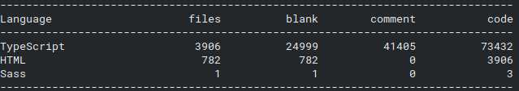
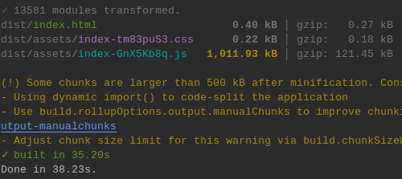
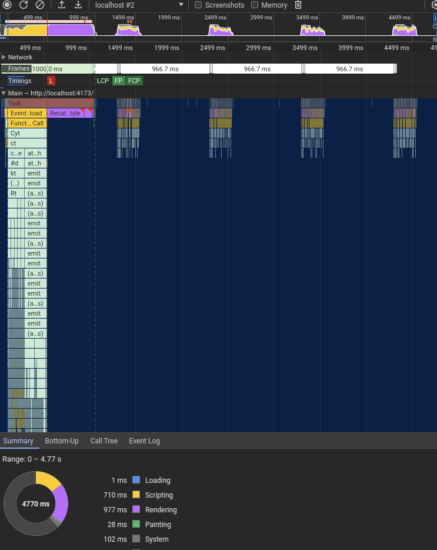
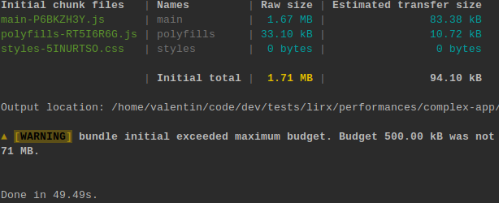
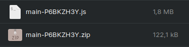
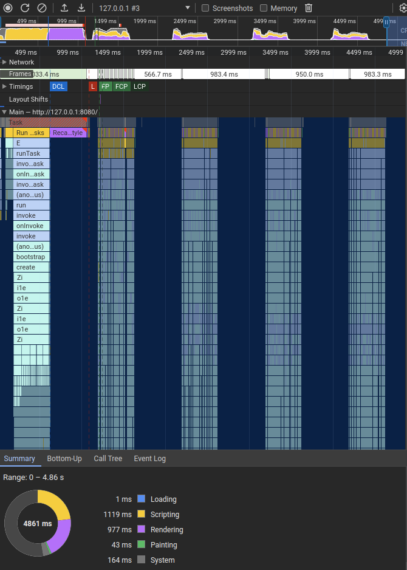
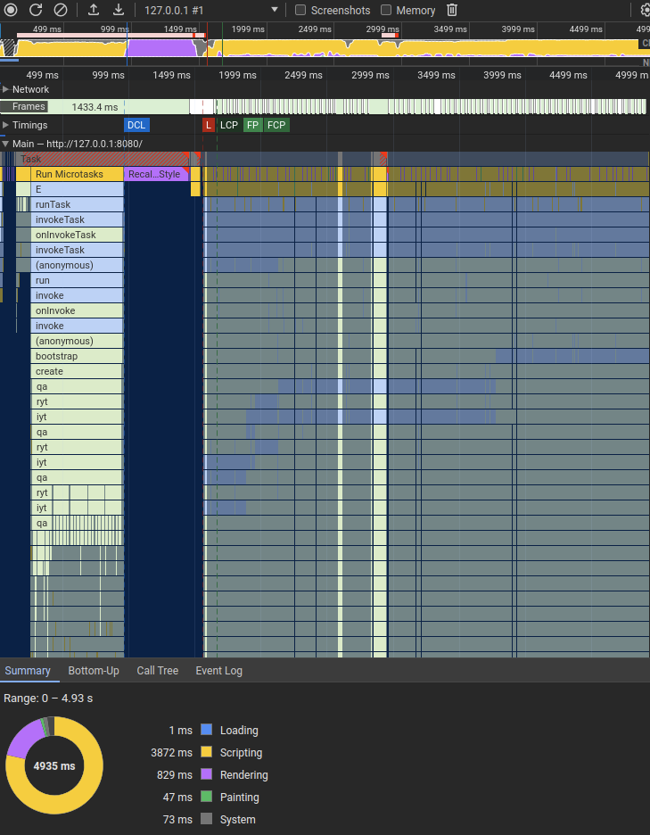

# Benchmark: The thousand components application

Alright, now let's get into the real world. I've autogenerated an application having approximately 3900 components and 73K lines of typescript.

## LiRX/dom

🚧 [SOURCE CODE](https://github.com/lirx-js/performances/tree/main/complex-app/lirx-dom)

This time the build is heavy:

But still, `@lirx/dom` managed to build the app in 121kB minziped (with AOT).

If we check the `Performance` panel:

The app was bootstrapped in ~500ms, and has an FCP of ~1000ms. Not bad for 14K DOM nodes.

Then, we may see that a DOM update is done every second for all the components: a date is refreshed and displayed.
Here it's fast, and takes less than 220ms, with only ~40ms of scripting (the rest is mostly rendering).

## Angular

[SOURCE CODE](https://github.com/lirx-js/performances/tree/main/complex-app/angular)

Now the Angular's build:

Angular uses brotly as transfer size, where vite uses gzip. Thus, for a fair comparison, I've gziped the Angular's `main.js` file:

We may rapidly see that both almost have an identical transfer size. However, the uncompressed Angular app is 1.7 times larger.
This has a small, but not negligible, impact when the javascript parser and compiler do their job.

Let's compare the `Performance` panel:

The boostrap is similar (~500ms), and the LCP is around 1200ms. So both frameworks are comparable when initializing the application.

However, when we compare the DOM updates, this is where we may immediately see the differences:
with Angular, it takes approximately 400ms to do the refresh, with ~210ms of scripting (and the rest is mostly rendering).
It's four time the scripting duration of `@lirx/dom` and the total "update window" is double.

#### With `ChangeDetectionStrategy.Default`

As said earlier, to be as fair as possible, I've optimized the Angular app to deliver the best performances.
Thus, I've used `ChangeDetectionStrategy.OnPush` for all components.
However, this doesn't truly reflect the reality where most of the components are usually `ChangeDetectionStrategy.Default`.
This is the case on the Angular example repositories and pages, and probably most of Angular's applications outside.

So, let's see how `ChangeDetectionStrategy.Default` performs:

As expected, this is pretty bad: the CPU saturates, the app slows drown dramatically (if not frozen),
and it becomes almost impossible to interact with the content.

This example may be relevant or not: it depends on your apps, how you optimize them, and the balance you chose between code simplicity and rapidity, 
versus the efficiency of your applications.

`@lirx/dom` tries to get the best: simplicity and effectiveness of coding, while maintaining excellent performances.

## Conclusion

As shown in this simple example, `@lirx/dom` is truly competitive: it's fast, small, and offers a framework as complete as the others.

Maybe it's the perfect opportunity for you to try a different framework, and embrace a different programming paradigm ?

If performances matter to you, it's worth testing it 🦸.

