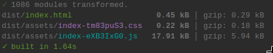
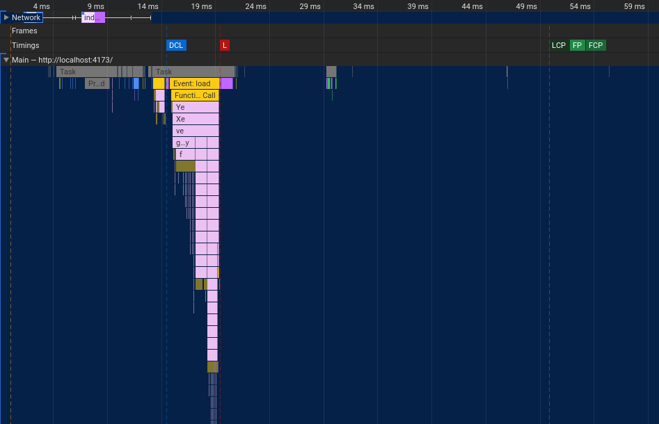
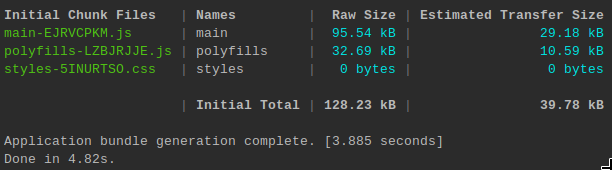
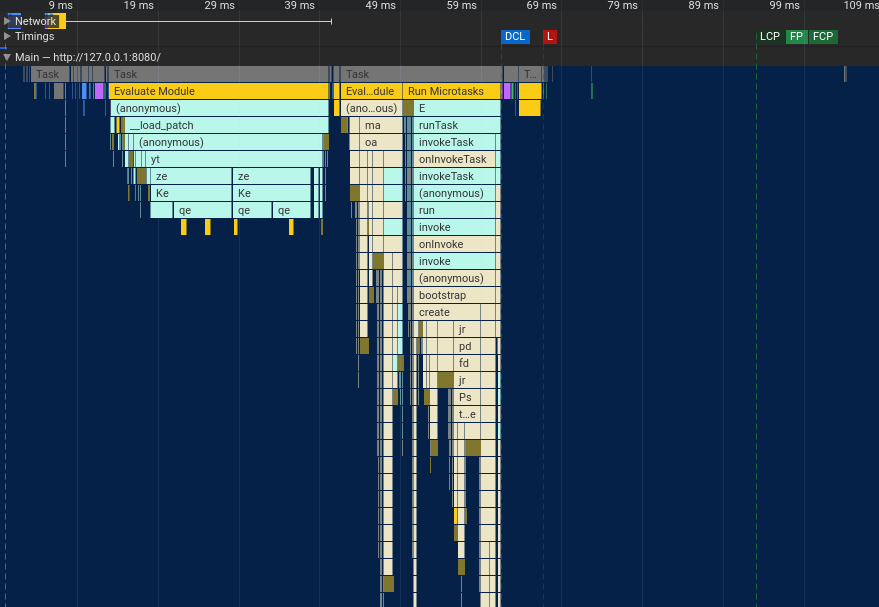

# Benchmark: File to data-url application

Let's begin small. We will compare the same simple app:
a drag and drop area used to convert a file to a [data url](https://developer.mozilla.org/en-US/docs/Web/HTTP/Basics_of_HTTP/Data_URLs).

## LiRX/dom

[SOURCE CODE](https://github.com/lirx-js/performances/tree/main/file-to-data-url/lirx-dom)

Let's build the application:

The gzipped version of the app on `@lirx/dom` is only ~6KB.

Then, we may open the `Performance` panel and have a quick look:

The javascript is minimal and runs approximately 10ms, giving us an FCP in ~50ms. 

## Angular

[SOURCE CODE](https://github.com/lirx-js/performances/tree/main/file-to-data-url/angular)

Then, let's compare with angular. I have created two applications: one with zonejs and the other zone-less.
Currently, the zone version is faster and smaller, so I took this version as reference, however, in the future, it may change, and we will update this test in accordance.

The gzipped version of the app on `Angular` is around ~29KB and ~40KB if we include zonejs.

This gap will reduce when applications grow, as most of the code will come from the developers instead of the frameworks themselves.

Still, this shows that `@lirx/dom` is well optimized and has a very small footprint: it may be used for light applications or even for standalone components.

Next, let's take a look on the javascript execution time at startup:

With Angular, we are around ~55ms (reduced to approximately 30ms if we exclude zonejs), giving us an FCP in ~100ms.

### First impressions

This application is really simple and light, but it shows that `@lirx/dom` already performs well against Angular: it's smaller, faster, and uses less resources.

However, this doesn't represent most applications which commonly have many more components and scripts, thus, 
we'll see next a complex use case that is more representative of large applications.

