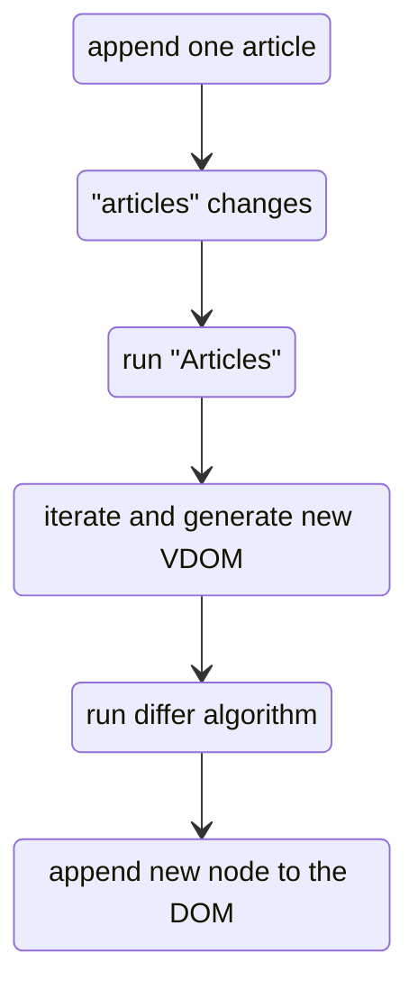
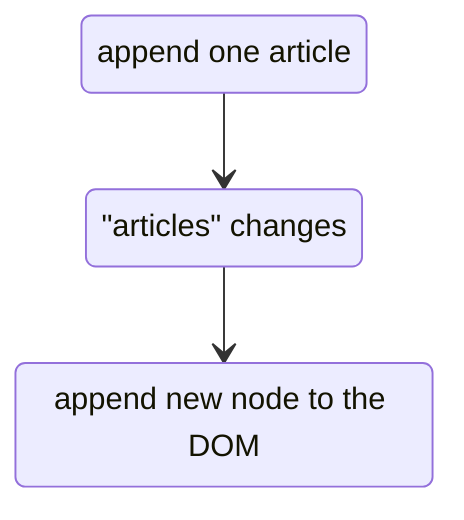

# Differences with React

React is a UI framework based on a Virtual DOM, in consequence, we have first to give a definition of it:

> The virtual DOM is a structure akin to the DOM.
> It is slimmer and has a subset of the API of the structures defined in the DOM JS spec e.g. HTMLElement.
> VDOM is a virtual representation of the document, actual DOM references the document (e.g. .click() isn't on VDOM structures).
> It is used to add to or update the existing actual DOM / UI.

VDOM implements declarative programming. When state changes it recreates the UI by rerunning the method with the declaration method.
This allows programming as a map state of the rather than manually adding the imperative updates to the document at every state change.

### The VDOM isn't free:

#### Every update requires evaluating the UI

Every time an update to state happens, the runtime needs to **rebuild the UI whole tree** (at least from the parent where the change occurred).
This is necessary to find that any of the nodes have changed, **but the majority of the new UI hasn't changed**, and you have to create and store duplicate nodes.
The UI can require evaluating expensive calculations that often returns the existing value.

Moreover, because a lot of virtual DOM elements are created every time the DOM updates, **the cost in memory is important**,
and the number of virtual nodes is also linearly proportional to the size of the DOM tree.


A simple and common illustration for such a limit, are loop rendered elements:

```tsx
const Articles = ({ articles }) => {
  const articles = articles.map((article, index) => (
    <Article key={index} article={article} />
  ));

  return (
    <section>
      { articles }
    </section>
  );
};
```

Each time `articles` changes, even for a single addition of an article, the whole VDOM is recreated (however not everything is rendered).




It means that **even the most basic operations aren't free**.
Things get even worse when we add other kind of computations (ex: reducers, sorts, etc...).

#### Inferring the DOM changes cost a lots of computation

To find the updates, the VDOM frameworks use a process named **"diffing"**.
After a new frame has been built it has to be compared to an original frame, which requires walking these trees and comparing nodes.
This has an important computation cost, especially on large applications.


> In consequence, the VDOM uses a **high amount of memory and CPU**.

### A better way

If a property related to only one node changes, then only this node should be updated, instead of its whole context.

It means we should be able to skip: re-running the component's context (`Articles`), iterating over the new list of articles to generate a new VDOM,
and running a differ algorithm.

Instead, we should be able to immediately append a Node into the DOM, when we add one article into `articles`.




Doing this drastically improves the performances, as we avoid all the unnecessary computations.

### Reactive Programming as solution

Actually, this is exactly what does `@lirx/dom` with the help of Reactive Programming:


```ts title="main.component.ts"
// in the init function
const items = signal([]);

const addItem = (item) => {
  items.set([...items(), item]);
};
```

```html title="main.component.html"
<app-item
  *for="let item of $.items"
  [config]="item"
></app-item>
```

When we'll compile the template, the resulting javascript will append only one Node, when calling the function `addItem`.
There is no need of VDOM, no need of re-running the whole component (the `init` function),  nor applying a diffing algorithm.
Instead, the resulting javascript is smart enough to just append the new Node.

### Reactive Programming is similar to useState

If Reactive Programming feels a little odd, actually, you're already familiar if you're using hooks, and especially `useState`:


```tsx
export function Example() {
  const [count, setCount] = useState(0);

  return (
    <div>
      <p>You clicked {count} times</p>
      <button onClick={() => setCount(count + 1)}>
        Click me
      </button>
    </div>
  );
}
```

`count` may be considered as an Observable and `setCount` as an Observer.


The same example using `@lirx/dom`:

```ts
export const ExampleComponent = new Component({
  name: 'app-example',
  template: compileReactiveHTMLAsComponentTemplate({
    html: `
      <div>
        <p>You clicked {{ $.count }} times</p>
        <button (click)="() => $.count.set($.count() + 1)">
          Click me
        </button>
      </div>
    `,
  }),
  templateData: () => {
    const count = signal(0);

    return {
      count,
    };
  },
});
```

[//]: # (TODO stackblitz)

With React, when we'll click on the button, the function `Example` will be called again, re-generate the VDOM, apply a diffing algorithm, and update the Text Node.

With `@lirx/dom`, clicking on the button will simply do: `textNode.value = $.count() + 1;`.

No other node is touched, nor updated; and no tree (VDOM) is generated. It simply changes what's need to be modified, and nothing more.
This trick gives an incredible advantage in memory consumption and execution time for `@lirx/dom`.

However, it will cost a deeper learning curve, as thinking in Reactive Programming is not an easy task.
**You'll trade simplicity for robustness and performances.**
For small apps, it won't matter, but for large apps that need to scale, it makes a huge difference.
