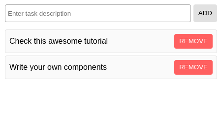
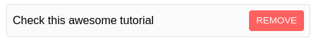
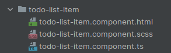

# Introduction to Component

To explore the possibilities of `@lirx/dom`, we'll create a simple **todo list**:




This tutorial will cover the most essential parts of this framework through a comprehensive  and generic example.
After following it, you'll be able to create your own components and start to develop great web applications.

Everything is available [in this repository](https://github.com/lirx-js/dom-examples/tree/main/src/todo-list).
I encourage you to clone it, as it is a very good starting point.

## Our first component

First, let's define what is a component:

> A component is the most basic UI building block of a web app.
It is equivalent to an Element, but it has its own template, style, properties, and interactions.
It is not provided natively by the browser, but constructed by ourselves or from an external library using `@lirx/dom`.

An **application** is simply formed from a tree of components, starting from a "*root*" component.


### Files structure

Just like Angular, `@lirx/dom` follows the [MVC](https://developer.mozilla.org/en-US/docs/Glossary/MVC) pattern.
This means that a component is usually constituted of 3 files:

An **html file** whose name usually ends with `.component.html`.
This file contains the template of the component, which extends the HTML syntax with custom attributes and tag names.
It is used to generate and manipulate the DOM.

A **scss file** whose name usually ends with `.component.scss`.
This file contains the style of the component, and may contain css variables to allow the parent elements to easily modify the style of this component.
`.css` files are supported too, but `.scss` is strongly recommended, as it is much more concise and practical.

A **typescript file** whose name usually ends with `.component.ts`.
This file defines the component itself, imports the template and styles, registers interactions from the user or other events,
and sets the values required by the template. `.js` files are supported too, but we encourage the usage of typescript.

We'll focus now on the "rows" of our todo list. We'll call this component `todo-list-item`.
It's simply a container with a message field and a remove button:



So let's start by creating a folder for this component:

```bash
mkdir todo-list-item
cd todo-list-item
```

Then we have to create the template, style, and definition of this component (in three separate files):

```bash
touch todo-list-item.component.html todo-list-item.component.scss todo-list-item.component.ts
```

We end up with this files' structure:




### Template

The template of our component will use a [custom HTML syntax](/docs/documentation/syntax/) called `reactive-html`.
It is based on custom attributes and tags, is compatible with the standard HTML, and allows us to easily manipulate the DOM through [Observables](https://core.lirx.org).

We'll start by editing the file `todo-list-item.component.html`:


```html title="todo-list-item/todo-list-item.component.html"
<div class="message">
  {{ $.message$ }}
</div>
<button
  class="remove-button"
  (click)="$.$onClickRemoveButton"
>
  Remove
</button>
```

Every template receives a local `$` variable.
This variable contains the data used by the template, and they will be reflected on the DOM.
We'll see later that the content of `$` is defined into the `.ts` file (here `todo-list-item.component.ts`).

The first block creates a &lt;div&gt; those content is a Text node updated each time `$.message$` changes.
Such a node is created by putting an Observable in double curly brackets, `{{}}` ([documentation](/docs/documentation/syntax/reactive-text/)).

```html
<div class="message">
  {{ $.message$ }}
</div>
```

The second block creates a &lt;button&gt; with a `click` EventLister, whose events are sent to the Observer `$.$onClickRemoveButton`.
This is achieved through the custom attribute `(click)` ([documentation](/docs/documentation/syntax/attributes/event/event-listener/)).

```html
<button
  class="remove-button"
  (click)="$.$onClickRemoveButton"
>
  Remove
</button>
```

So, when the user will click on this button, it will call the function `$.$onClickRemoveButton`.

:::note

`@lirx/dom` takes care to subscribe/unsubscribe to the Observables when the nodes are connected or leave to the DOM.
This guaranties an optimal usage of the resources.

:::

### Style

A component is nothing without style, so let's add some to it:

```scss title="todo-list-item/todo-list-item.component.scss"
:host {
  display: flex;
  align-items: center;
  justify-content: space-between;
  gap: 5px;
  padding: 8px;
  border-radius: 4px;
  border: 1px solid #e1e1e1;
  background-color: #fafafa;

  & > .remove-button {
    padding: 0 10px;
    background-color: #ff6060;
    border-radius: 4px;
    border: 0;
    text-transform: uppercase;
    line-height: 30px;
    color: #fff;
    cursor: pointer;
  }
}
```

The css of the component is the same as one for a [custom element](https://developer.mozilla.org/en-US/docs/Web/CSS/:host_function).
It supports `:host` and `:host-context` to select the element.
However, unlike custom elements using the shadowDOM, the css is not purely scoped and strictly limited to the component.

In consequence, **without attention**, some style may **leak** on the descendants or on the global scope.
This would result in unwanted behaviour,
so we encourage the developers to follow these rules:

- always put the style and selectors into an `:host`.
 If we write a selector outside an `:host`, it won't be scoped to the component, and it will apply globally.
 Sometimes it may be useful, if, for example, we want to style some elements outside our component, but it must be used with extreme precautions.
- always use the `>` ([child combinator](https://developer.mozilla.org/en-US/docs/Web/CSS/Child_combinator)) selector.
 Else, we may select deep children, and apply unwanted style to them.
- always [set a display](https://web.dev/custom-elements-best-practices/#:~:text=Custom%20elements%20are%20display%3A%20inline,to%20laying%20out%20the%20page.) to the component.

We chose to remove the constraints imposed by the shadowDOM, as we want the developers to be able to style external components (coming from an external library),
which is common, and especially useful on unmaintained ones.
However, with great power comes great responsibility, so it's your role to take care not to leak any css outside your component's scope.

### Component

The component itself is defined into a typescript file (in our example: `todo-list-item.component.ts`).

#### Import the template and style

We'll start by importing the template and the style of the component:

```ts
// @ts-ignore
import html from './todo-list-item.component.html?raw';
// @ts-ignore
import style from './todo-list-item.component.scss?inline';
```


Using [vitejs](https://vitejs.dev/guide/assets.html#importing-asset-as-string) or the [aot compiler](/docs/documentation/aot-compiler/),
we may import various file contents using the esm syntax.

#### Define the component's configuration

Then, we'll define the interface of the data (`$`) required by our template:

```ts
interface IData {
  readonly message$: IObservable<string>;
  readonly $onClickRemoveButton: IObserver<any>;
}
```

Let's remember that our template requires a `$.message$` variable, displayed in a &lt;div&gt;.
In consequence, we'll have to provide an `Observable<string>` to fill this content.

Furthermore, we want to intercept the user's clicks on the remove button.
So we'll use the Observer `$.$onClickRemoveButton` for this usage.

The next step consists of defining the configuration of the component itself:

```ts
interface ITodoListItemComponentConfig {
  element: HTMLElement;
  inputs: [
    ['message', string],
  ];
  outputs: [
    ['remove', void],
  ];
  data: IData;
}
```

Let's break down each line:

```ts
element: HTMLElement;
```

The component is an `HTMLElement` (it's the default element's type).
We could have written `element: HTMLButtonElement` if we wanted to extend a button instead.

```ts
inputs: [
  ['message', string],
];
```

The component accepts one input of type `string`, called "*message*".
An input is an entry point to send values to the components through named properties.
In our example, the parent component will set this property, and it will be displayed in our component.

```ts
outputs: [
  ['remove', void],
];
```

As an output, we have "*remove*". It may be seen as an Event dispatched and listened by EventListeners like `onclick`, `onkeydown`, etc.
In our example, the parent component will receive this event when the user clicks on the remove button.

```ts
data: IData;
```

Finally, in the component's interface, we have to set the data type required by its template.

:::info

`@lirx/dom` aims to be strongly typed. It's more verbose, but it grants pre-compilation bug detection, and guaranties more robust applications.

:::

#### Create the component

To create a component, we'll use the function [createComponent](/docs/reference/create-component/), with a configuration's object,
matching our previously defined interface:

```ts
export const TodoListItemComponent = createComponent<ITodoListItemComponentConfig>({
  name: 'app-todo-list-item',
  template: compileReactiveHTMLAsComponentTemplate({ html }),
  styles: [compileStyleAsComponentStyle(style)],
  inputs: [
    ['message'],
  ],
  outputs: [
    'remove',
  ],
  init: (node: VirtualCustomElementNode<ITodoListItemComponentConfig>): IData => {
    const message$ = node.inputs.get$('message');
    const $onClickRemoveButton = node.outputs.$set('remove');

    return {
      message$,
      $onClickRemoveButton,
    };
  },
});
```

Alright, we'll explain the lines one by one:

```ts
name: 'app-todo-list-item',
```

This is the name of our component.

:::note

We recommend to **always prefix** the components with the **same characters**.
Usually it will be `app-`. It permits to easily do the distinction between the native elements, our app's components,
and the components coming from external libraries. This is similar to a namespace, but for components.

:::

```ts
template: compileReactiveHTMLAsComponentTemplate({ html }),
```

Before being assigned to the component, **a template requires to be compiled** using the function [compileReactiveHTMLAsComponentTemplate](/docs/reference/compile-reactive-html-as-component-template/).
Compiling the templates to executable javascript, allows many internal optimizations, permits AOT compilation, and drastically increase the performances of the application.


```ts
styles: [compileStyleAsComponentStyle(style)],
```

Styles requires to be compiled too, using the function [compileStyleAsComponentStyle](/docs/reference/compile-style-as-component-style/).

```ts
inputs: [
  ['message' /*, initialValue */],
],
outputs: [
  'remove',
],
```

If our component has inputs and/or outputs, we have to define them, and we may set an initial value for our "*message*" input (optional).

```ts
init: (node: VirtualCustomElementNode<ITodoListItemComponentConfig>): IData => {
  // ...
},
```

Finally, we have the `init` function.
This is where we'll define the interactions, the data, the pipelines, etc.
In short: control everything that appends in the component.

This *init* function is called when the component is instanced, and
receives a single argument: `node: VirtualCustomElementNode`.
This is a representation of the node in the DOM.
It has some useful methods and properties to: bind Observables with this node, listen to events, subscribes to inputs, dispatch outputs, etc.
Then, this function returns the data required by the template.

So, we'll use this function to bind the inputs and outputs with the data required by the template:


```ts
// get the 'message' input as an Observable
const message$ = node.inputs.get$('message');
// get the 'remove' output as an Observer
const $onClickRemoveButton = node.outputs.$set('remove');

// returns the data required by the template
return {
  message$,
  $onClickRemoveButton,
};
```

#### Bring all together

Phew 😵‍💫, it was a technical part with a lot of new things to remember ! But we did it 🥳.

[Here's the code](https://github.com/lirx-js/dom-examples/tree/main/src/todo-list/components/todo-list-item) for our `todo-list-item` component:

import TodoListItem from './_todo-list-item.mdx';

<TodoListItem/>

## The todo-list component

Alright, we've created our first component displaying a "*message*" provided as input and sending a "*remove*" event as output.
Now, we'll create the component initializing and managing many `todo-list-item`, and call it `todo-list`.

When the user enters a new message, it will append a new `todo-list-item` to a list, and when the user clicks on the "remove" button,
this item will be removed from this list.


Let's begin by creating the correct directory, and it's associated files for this component:

```bash
cd ..
mkdir todo-list
cd todo-list
touch todo-list.component.html todo-list.component.scss todo-list.component.ts
```

I'll give you now the content of each file. However, **do not focus yet** on the code, as I'll explain it line by line right after.
However, I'll skip the explanation for the `.scss` file. It's only there to give a nice look to our component with just css.

import TodoList from './_todo-list.mdx';

<TodoList/>


Let's start with the template:

```html
<form
  class="input-form"
  (submit)="$.$onFormSubmit"
>
  ...
</form>
```

This creates a form containing an input with a submit button.
It is used to let the user enter a message and submit it.
As seen into the previous component, we subscribe to the "*submit*" event using the syntax: `(submit)="$.$onFormSubmit"`, and sent it to an Observer.

This Observer will look like this:

```ts
const $onFormSubmit = (
  event: Event,
): void => {
  event.preventDefault(); // we want to prevent our form to be submitted

   // get the input's value
  const inputValue: string = getInputValue().trim();

  if (inputValue !== '') {
     // add a new entry
    addItem(inputValue);
  }

  // reset the input's value
  $inputValue('');
};
```

The next step - the input itself:

```html
<input
  [value]="$.inputValue$"
  (input)="$.$onInput"
  placeholder="Enter task description"
/>
```

`[value]="$.inputValue$"`: subscribes to the Observable `$.inputValue$`, and assigns the received values to the &lt;input&gt;'s property `value` -> `input.value = ...`
([documentation](/docs/documentation/syntax/attributes/bind/reactive-property/)).

In the `.ts` file, we have to define [a Source using let$$](https://core.lirx.org/docs/reference/let/), containing this value:

```ts
const [$inputValue, inputValue$, getInputValue] = let$$<string>('');
```

Now, if we sent a value though `$inputValue` (ex: `$inputValue('some content')`), then, the input will immediately reflect this value.

`(input)="$.$onInput"`: you probably guess what it does 😉. It subscribes to the "*input*" event, and sends them to the Observer `$.$onInput`.

To create this Observer, we have to convert the incoming "*input*" events into the actual value of the input (using `$$map`).
And then, assign these values to the Observer `$inputValue`.

```ts
const $onInput = $$map($inputValue, (event: Event): string => (event.target as HTMLInputElement).value);
```

So, when the user types into the input, it updates properly the `inputValue$` Observable.

If this part is a little too complex, I encourage you to take a look at the [@lirx/core](https://core.lirx.org/docs/reference/observable/) reference page.
Here, you'll find all the necessary documentation for each function we'll use into the `.ts` file.

Alright, let's continue

```html
<app-todo-list-item
  *for="let item of $.items$"
  $[message]="item.message"
  $(remove)="() => $.removeItem(item)"
></app-todo-list-item>
```

`*for="let item of $.items$"`: this iterates over the values send by the Observable `$.items$` ([documentation](/docs/documentation/syntax/rx-components/rx-for-loop/)).
For each value presents in the received array, it creates an `app-todo-list-item` component,
and, this value is represented by the local variable `item`.

Now, we have to define `$.items$`:

```ts
const [$items, items$, getItems] = let$$<ITodoListItemsList>([]);
```

Just like we did with the input's value, here, we're using a Source to store our items.
These items are simply objects with a `message` property:

```ts
interface ITodoListItem {
  readonly message: string;
}

type ITodoListItemsList = readonly ITodoListItem[];
```

As you may notice, we're only using **readonly** arrays and readonly properties.
Let me explain why:

> Observables are streams of data.
So mutating the data itself (like the property of an object or the content of an array), won't emit a new value into the corresponding Observable.
In our case, it means "*no DOM updates*".
Instead, we have to use immutable values, and send new references when a change occurs.

In consequence, to add a new item in the list, we'll write:

```ts
const addItem = (
  message: string,
): void => {
  $items([
    ...getItems(),
    {
      message,
    },
  ]);
};
```

:::note

If you feel concerned about immutability performances, you'll have to know that modern javascript engines (ex: V8)
optimize such patterns, with performances often close a "classic" mutation.
In consequence, most of the time, it should not be an issue.

Yet, if you still prefer to mutate to original data instead of creating a new reference, you may perfectly do it:
**as long as you re-emit** the reference into the Observable.

:::

`$[message]="item.message"`: this line sets `item.message` as the value of the '*message*' input of the component `app-todo-list-item` ([documentation](/docs/documentation/syntax/attributes/bind/reactive-input/)).
Instead of a static value, we could have used an Observable.
It's up to you, as most [attribute's binding](/docs/documentation/syntax/attributes/bind/) accept an Observable as well as a plain value.

`$(remove)="() => $.removeItem(item)"`: it subscribes to the output '*remove*', and calls the function `$.removeItem` when it appends ([documentation](/docs/documentation/syntax/attributes/event/reactive-output/)).

This function gets the list of items, searches for the index of the removed one, and updates `$items` with a new list not containing this item:

```ts
const removeItem = (
  item: ITodoListItem,
): void => {
  const items: ITodoListItemsList = getItems();
  const index: number = items.indexOf(item);
  if (index !== -1) {
    $items([
      ...items.slice(0, index),
      ...items.slice(index + 1),
    ]);
  }
};
```

Finally, we have to declare which components we're using in this template:

```ts
template: compileReactiveHTMLAsComponentTemplate({
  html,
  customElements: [
    TodoListItemComponent,
  ],
}),
```

Here, we're employing `app-todo-list-item`, so we have to import the real component into the `.ts` file.
If we don't, the framework will emit an Error.

> This is a security to ensure that **every** component **exists** and is properly loaded before rendered.


Hurrah 🤩, you've survived to the longest part !

The `todo-list` is ready and functional, however, we still have to define an entry point for our application.


## Starting the application

A little more patience, we're almost done 😌.

We have all the required components, so the last step is to "*start*" our application.
To do this, we'll use the function [bootstrap](/docs/reference/bootstrap/):

```ts title="main.ts"
import { bootstrap } from '@lirx/dom';
import { TodoList } from './todo-list/todo-list.component';

bootstrap(TodoList);
```

It simply takes as input the "root" component of our application and injects it into the DOM, starting our application.

And voilà ! The application is ready to be used.

## Conclusion

You are now a champion of `@lirx/dom` 🏆.

You've learned the basics, and know perfectly:

- what is a component
- what is a template, and how to create one
- what are the components' **inputs** and **outputs**
- how you can use the Observables to interact with your template

Now, it's time to create your own application 🚀.

