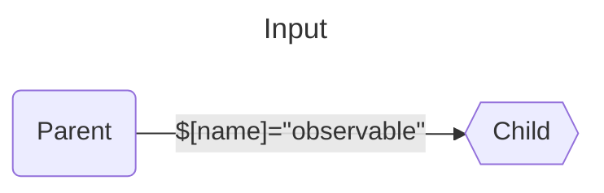
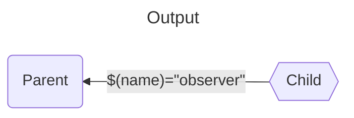

# Inputs and Outputs

Inputs and Outputs permits to interact and communicate between components.
This is a gateway to send and listen to values from a parent component and one of its child.

## Input



An [Input](/docs/reference/input/) **stores a data** that may be updated once or many times.
It is **observable** by the *child component* through its `subscribe` ([Observable](https://core.lirx.org/docs/reference/observable/)) property,
and is **settable** by the *parent component* using the `emit` ([Observer](https://core.lirx.org/docs/reference/observer/)) function:


```ts
declare class Input<GValue> {
  constructor(initialValue?: GValue);

  readonly emit: IObserver<GValue>;
  readonly subscribe: IObservable<GValue>;
  readonly value: GValue;
}
```

It's possible to define an `initialValue` for an Input while constructing it.

## Output



An [Output](/docs/reference/output/) **transmits**, but **doesn't store**, a data **from the child to the parent component**.
The parent observes the data using the `subscribe` function, and the child emits the data using the `emit` function.


```ts
declare class Output<GValue> {
  readonly emit: IObserver<GValue>;
  readonly subscribe: IObservable<GValue>;
}
```

An Output is extremely similar to an [EventTarget](https://developer.mozilla.org/en-US/docs/Web/API/EventTarget),
where a child component may emit an Event for one of its parent.

## Usage

Inputs and Outputs are **defined in the child components**, and are **used by the parent components** to communicate them.
Let's see how.

> As an example, I'll create a child component displaying an `<input>` and having simple Inputs/Outputs reflecting the value of this `<input>`.

### From the child component

We'll start by writing an interface describing the Inputs and Outputs of our component:

```ts
interface IChildComponentData {
  readonly value: Input<string>;
  readonly valueChange: Output<string>;
}
```

Here, we declare that our component has an Input named `value` of type `string`. 
We'll use it to set the value of an `<input>` element in the template.

Secondly, we declare an Output (`valueChange`), that will emit the new value of the `<input>` when it changes.

Now, it's time to create the component:

<details>
  <summary>Expand the code</summary>

```ts
// the inputs and outputs.
interface IChildComponentData {
 readonly value: Input<string>;
 readonly valueChange: Output<string>;
}

// the data required by our template
interface ITemplateData {
 readonly value$: IObservable<string>;
 readonly onInput: IObserver<Event>;
}

// the component itself
export const AppChildComponent = new Component<HTMLElement, IChildComponentData, ITemplateData>({
  name: 'app-child-component',
  template: compileReactiveHTMLAsComponentTemplate({
  html: `
    <input
      [value]="$.value$"
      (input)="$.onInput"
    >
  `,
  }),
  styles: [compileStyleAsComponentStyle(style)],
  // inputs and outputs of the component are instanciated in this function
  componentData: (): IChildComponentData => ({
    value: input<string>('' /*let's initialize it with an empty string */), // or new Input<string>('')
    valueChange: output<string>(), // or new Output<string>()
  }),
  templateData: (node: VirtualComponentNode<HTMLElement, IChildComponentData>): void => {
    // gets the input `value` as an Observable
    const value$ = node.input$('value');
    // gets the output `valueChange` as an Observer
    const $valueChange = node.$output('valueChange');
    
    // when the input changes
    const onInput = (event: Event): void => {
      // we emit the new value in the output `valueChange`
      $valueChange((event.target as HTMLInputElement).value);
    };
    
    return {
      value$,
      onInput,
    };
  },
});

```

</details>

Inputs and Outputs are defined in the `componentData` function:

```ts
componentData: (): IChildComponentData => ({
  value: input<string>(''),
  valueChange: output<string>(),
}),
```

And, we'll get and interact them into the `templateData` function:

```ts
// to get the Input as an Observable
const value$ = node.input$('value');

// to get the output as an Observer
const $valueChange = node.$output('valueChange');
```

The rest of the code binds these Inputs and Outputs with the template.
I won't detail it there, as it is not the primary subject of this topic.

### From the parent component

Let's switch to the parent component's `reactive-template`, to use our newly created Inputs and Outputs:

```html
<app-child-component
  $[value]="$.value$"
  $(valueChange)="$.$value"
></app-child-component>
```

To bind an Input with an Observable, we use special attribute's syntax `$[inputName]`, where `inputName` is the name of the Input,
and the right side is an Observable, whose content is bound to this Input.

> **It simply does:** subscribe to the Observable `$.value$` and emit the values to the Input `value`.

The Output is similar but using parenthesis instead of square brackets `$(outputName)`.
Moreover, the right side is an Observer instead of an Observable.

> **It simply does:** subscribe to the Input `value` and emit the values to the Observer `$.$value`.


:::note

Inputs and Outputs are automatically unbound when the component is not connected to the DOM, and rebound when it is connected.
This ensures maximal performances and minimal manual cancellation.

:::

For more details about the syntax, you may check these links: [Input](/docs/documentation/syntax/attributes/bind/reactive-input/)
, [Output](/docs/documentation/syntax/attributes/event/reactive-output/).


<details>
  <summary>Quick look at the parent component typescript</summary>

If we had to define the parent component's interface for the template's data:

```ts
interface ITemplateData {
  readonly value$: IObservable<string>;
  readonly $value: IObserver<string>;
}
```

And create these data from the `templateData` function:

```ts
templateData: (node: VirtualComponentNode<HTMLElement, any>): ITemplateData => {
  // ... here we setup value$ and $value ...
  const value = signal('');
  const value$ = fromSignal(value);
  const $value = value.set;
    
  return {
    value$,
    $value,
  };
},
```

</details>

## Conclusion

Inputs and Outputs are the way of communication between your components.

Unlike `customElements`, which use attributes and events to do the communication between parent and child component,
 `@lirx/dom` uses Inputs and Outputs that allow relativity and don't constrain you on specific types
(attributes with `customElements` are typically limited to string, number and boolean).

So unleash all the power of your components without limits ⚡.


