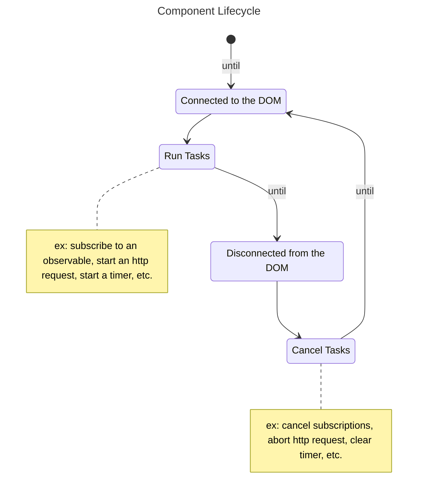

# Lifecycle



Understanding and employing property the lifecycle of a component is a **very important task**.
This is one of the most essential aspect of every front-end framework, so, please, **pay a special attention** to this concept while creating your components.

Every component have **two states**:

- `connected to the DOM`: when entering this state, this is the perfect moment to start all async tasks related to this component.
Like: http requests to fetch data, timers, subscriptions to Observables, etc.
- `disconnected from the DOM`: when entering this state, this where we **MUST** *abort/cancel/unsubscribe* all our async tasks.
If undone properly, memory leaks will occur, and our application will start to have inconsistent states.

:::note technical node

A component is said `connected to the DOM`, when it has a [VirtualRootNode](/docs/reference/virtual-root-node/) as parent (direct or indirect).
This usually happens when the component has the `document` itself as one of its parents.

:::

---

In this tutorial, we'll try to implement a component displaying the current date, with a refresh period of 1000ms.

---

## Manual lifecycle handling

Let's start by remembering that **all the internal logic** of the component,
**must** be handled from the `templateData` function (defined when constructing a `Component`):

```ts
export const MyComponent = new Component({
  // ...other properties
  templateData: (node: VirtualCustomElementNode<HTMLElement, object>): void => {
    // here we'll manage the node's state, and all the logic of the component
  },
});
```

A naive solution would consist of using a `setInterval` and logging the result:

```ts
export const MyComponent = new Component({
  // ...other properties
  templateData: (node: VirtualCustomElementNode<HTMLElement, object>): void => {
    const logDate = () => {
      console.log('date', new Date().toString());
    };
    setInterval(logDate, 1000);
  },
});
```

However, in this example, if the component is removed from the DOM, the `setInterval` **won't stop**.
It will continue to log the date, until the user refreshes or closes the app.
So we have to find a solution to start this timer only when the component is connected to the DOM,
and stop it when it is disconnected.

Hopefully, the framework has the perfect solution to this problem: [Observables](https://core.lirx.org).
Indeed, cancellation is one of the main concern of Reactive Programming, and is one of the essential bricks of `@lirx/dom`.

The init function receives a single parameter `node` of type [VirtualCustomElementNode](/docs/reference/virtual-custom-element-node/).
This object contains many properties and methods, including some to play with the component's lifecycle:


```ts
interface VirtualCustomElementNode {
  readonly isConnected: boolean;
  readonly isConnected$: IObservable<boolean>;

  onConnected(
    factory: () => IUnsubscribe,
  ): IUnsubscribe;
  
  // ... and many more
}
```

The readonly `isConnected` property returns true if the node is connected to the DOM, and false otherwise.
Alone, it is not really useful as the component state changes when it is appended and removed from the DOM.
To observe these changes we may subscribe to the `isConnected$` Observable:

```ts
export const MyComponent = new Component({
  // ...other properties
  templateData: (node: VirtualCustomElementNode<HTMLElement, object>): void => {
    const logDate = () => {
      console.log('date', new Date().toString());
    };

    let timer: any;
    node.isConnected$((connected: boolean) => {
      if (connected) {
        timer = setInterval(logDate, 1000);
      } else {
        clearInterval(timer);
      }
    });
  },
});
```

However, there is a simpler manner -> using Observables with the method `onConnected(...)`.
It was specially designed for this purpose:

 - it takes a `function` as single input
   This function is called when the component becomes connected to the DOM. We'll subscribe to events, observable, timers, etc...
  and return an *"undo"* function which purpose is to clean all these async tasks. This "undo" function is called when the node leaves the DOM.
 - the `onConnected` method returns an *"undo"* function to stop listening on the "connected" state and clean-up the factory function.

So, we may reduce our previous exemple, in just a few lines of code:

```ts
import { interval } from '@lirx/core';
// ...
export const MyComponent = new Component({
  // ...other properties
  templateData: (node: VirtualCustomElementNode<HTMLElement, object>): void => {
    const interval$ = interval(1000);
    node.onConnected(() => {
      return interval$(() => {
        console.log('date', new Date().toString());
      });
    });
  },
});
```

This is where the beauty of Reactive Programming shines.
We may handle easily any async task, like: timers, promises, http requests, user events, etc... 
with automatic support of cancellation, simply using the method `onConnected(...)`.

## Automatic lifecycle handling

What about the Observables used into the template ?

Well, `@lirx/dom` takes care to subscribe or unsubscribe to them, when the corresponding node in the DOM
is connected or disconnected.

For example, `{{ $.date$ }}` creates an underlying [Text node](https://developer.mozilla.org/en-US/docs/Web/API/Text),
whose content is updated with the values sent by the Observable `$.date$`.
Then, it is subscribed automatically when the Text node is connected to the DOM, and unsubscribed when disconnected.

As a consequence, it's not necessary to wrap the Observables put in `ITemplateData` with the method `onConnected(...)`.

```ts
import { interval } from '@lirx/core';
// ...
export const MyComponent = new Component({
  // ...other properties
  template: compileReactiveHTMLAsComponentTemplate({
    html: '{{ $.date$ }}',
  }),
  templateData: (node: VirtualCustomElementNode<HTMLElement, object>): void => {
    const date$ = map$$(interval(1000), () => {
      return new Date().toString();
    });
    
    return {
      date$,
    };
  },
});
```

Therefore, the usage of `onConnected(...)` **should be limited to only a few cases**,
when we have some logic, which doesn't directly impact the template of the component.

## Conclusion


As seen during this tutorial, handling the lifecycle of the component is an important part, which requires to be managed with caution.
Else, it's easy to create inconsistent applications, due to concurrent async tasks, cumulated with memory leaks.

Hopefully, using Observables allows us to handle all the async ressources scoped to a component, in just a few lines of code.
