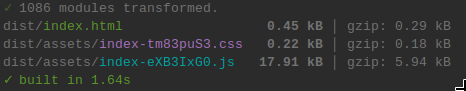
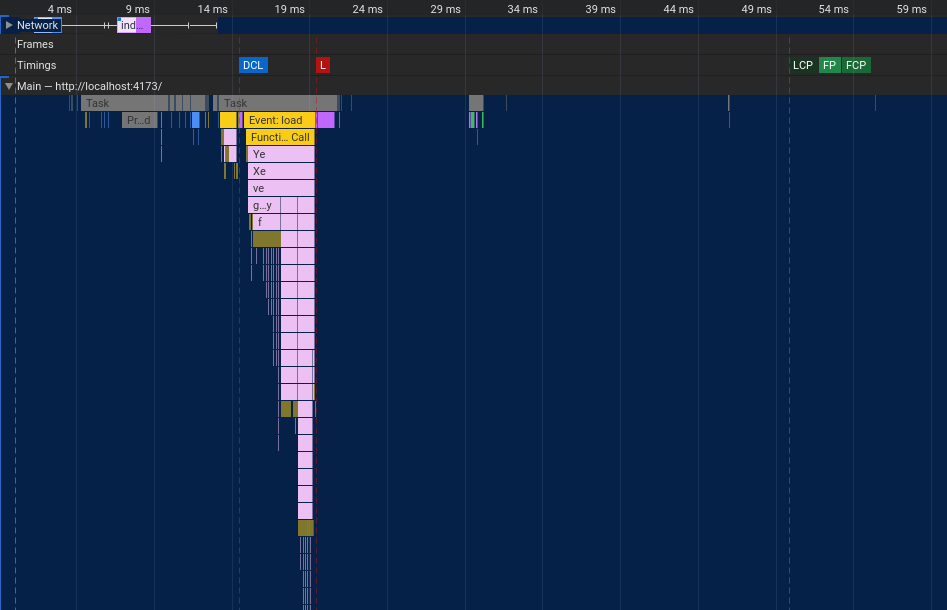
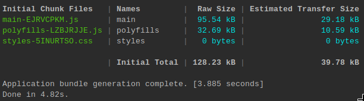
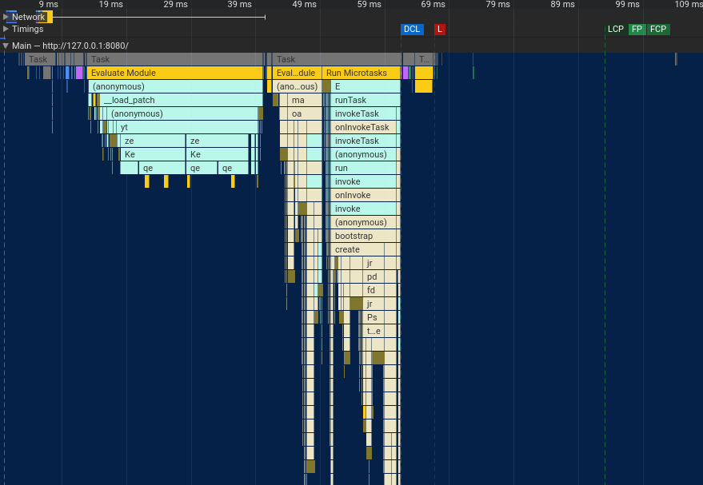

# Performance

`@lirx/dom` is **extremely performant** as it focuses on updating only what is relevant and nothing more,
running everytime the minimal javascript as possible.

Moreover, its [AOT compiler](/docs/documentation/aot-compiler/) allows optimizations while building the app, and generates smaller and faster builds.

This is **ideal for small to large applications** running in the browser where performances matter (ex: PWA).

To illustrate this, I've created the same app with different frameworks: a drag and drop area used to convert a file to a [data url](https://developer.mozilla.org/en-US/docs/Web/HTTP/Basics_of_HTTP/Data_URLs).

Each time I took the recommandations and best practices of the framework, and tried to optimize as much as possible in order to have a fair comparison.

:::note

Note that these results are not exhaustives. They won't cover every scenario, and results may vary according to your own applications.
However, they show that `@lirx/dom` is not lying when it says that it is fast: it will outperform the mainstream frameworks in most situations.

:::

## LiRX/dom

🚧 [link to code](TODO)

Let's begin by building the application:

The gzipped version of the app on `@lirx/dom` is only ~6KB.

Then, we may open the Performance panel and have a quick look:

The javascript is minimal and runs approximately 10ms, giving us an FCP in ~50ms. 

## Angular

🚧 [link to code](TODO)

Then, let's compare with angular. I have created two applications: one with zonejs and the other zone-less.
Currently, the zone version is faster and smaller, so I took this version as reference, however, in the future it may change.

The gzipped version of the app on `Angular` is around ~29KB and ~40KB if we include zonejs.

This gap will reduce when applications grow, as most of the code will come from the developers instead of the frameworks themselves.

Still, this shows that `@lirx/dom` is well optimized and has a very small footprint: it may be used for light applications or even for standalone components.

Finally, let's take a look on the javascript execution time at startup:

With Angular, we are around ~55ms (reduced to approximately 30ms if we exclude zonejs), giving us an FCP in ~100ms.

## Conclusion

As shown in this simple example, `@lirx/dom` is truly competitive: it's fast, small, and offers a framework as complete as the others.

Maybe it's the perfect opportunity for you to try a different framework this a different programming paradigm ?

If performances matter to you, it's worth testing it 🦸.

