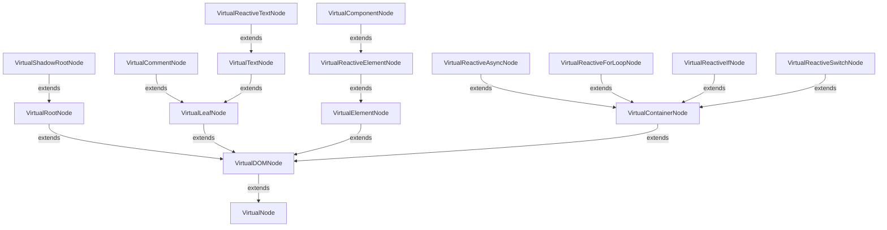

# Deep dive

:::caution

This tutorial will superficially describe how the framework works.
It will introduce you to some low-level classes and concepts, that you'll probably never use.
However, they may be useful to better understand how the DOM is rendered and and the components interact with each others.

Let's begin 🔥!

:::

### Virtual DOM

`@lirx/dom` use what we'll call a **Virtual DOM** (abbreviated *VDOM*).
This VDOM has nothing to do with the JSX VDOM. Only the name is shared, as both are... "Virtual DOM".
That's said, let's explain why we need such a Virtual DOM.

The *"real"* DOM is known to be slow to manipulate and has intrinsic limits:

- it doesn't have "virtual" containers.
  Those are containers that group nodes without generating an element into the DOM.
  In JSX they're expressed using `<>...</>` and `<ng-container>...</ng-container>` for Angular.
  They are really useful to manipulate a group of node in batch without having an element container in the DOM.
- listening to DOM changes is very inefficient. The `MutationObserver` is not intended to work with thousands of nodes and is deadly slow.
- the DOM is not reactive by nature, but all frameworks tends to be reactive for a good reason: front-end requires reactivity.

In consequence, we have to create an **abstract layer** to manage the DOM changes, allow batch operations, and improve complex DOM manipulations.
Here comes the Virtual DOM.

#### VirtualNode

The `@lirx/dom`'s VDOM is a tree of [VirtualNode](/docs/reference/virtual-node/).
This tree is very similar to the DOM tree, but it is lightweight and more efficient.
It was built to be very performant at detecting changes in its structure.
As a consequence, each node can easily detect if it is connected to the DOM or not.

:::note

This is the critical part of every front-end framework: update the DOM efficiently and automatically when a change is detected.

:::

#### VirtualDOMNode

In such a tree, because we're working with the DOM, all the nodes are [VirtualDOMNode](/docs/reference/virtual-dom-node/).
This class does the binding between a *virtual* DOM Node and one or more *real* DOM Nodes.

#### VirtualRootNode

A virtual node is said *"connected to the DOM"*, when it has a [VirtualRootNode](/docs/reference/virtual-root-node/) as parent (direct or indirect).

#### VirtualTextNode

A [VirtualTextNode](/docs/reference/virtual-text-node/) represents one of the most primitive DOM node: a [Text](https://developer.mozilla.org/en-US/docs/Web/API/Text) node.

#### VirtualReactiveTextNode

A [VirtualReactiveTextNode](/docs/reference/virtual-reactive-text-node/) adds **reactivity** to a `VirtualTextNode`.
This node, when connected to the DOM, subscribes to an observable and reflects the incoming string values into its associated `Text` node.
Thus, we have a Text node whose content is driven by an Observable, resulting in always fresh values, and fine-grained DOM updates.

---

### Example

When you [boostrap](/docs/reference/bootstratp/) your application, it creates the main component, and as a logical consequence, all the child `VirtualNode`.

This creates the *application* Virtual DOM's tree, whose *root* (`VirtualRootNode`) is the provided container (by default the `<body>`).

### Component

### Template

